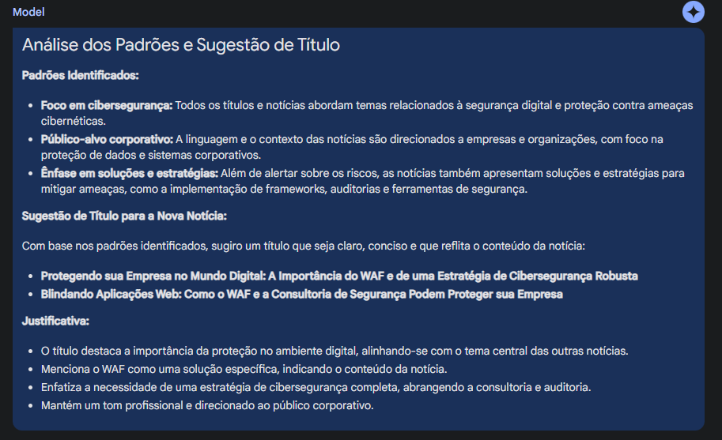

# PROMPT UTILIZADO NO GOOGLE AI STUDIO

Olá, tenho as 05 notícias abaixo com título e notícia.

1. Ataques de Phishing: Como Identificar e Proteger sua Empresa
   O phishing continua sendo uma das táticas mais eficazes e prejudiciais empregadas por cibercriminosos para violar a segurança das empresas. Esses ataques enganosos visam obter acesso não autorizado a dados confidenciais, como informações de login, números de cartão de crédito e outros dados pessoais ou empresariais sensíveis. Compreender os diferentes tipos de ataques de phishing e como se proteger é fundamental para manter a segurança de sua empresa.
2. Entenda a metodologia NIST CyberSecurity Framework 2.0
   A evolução contínua da tecnologia transforma a sociedade, trazendo novas oportunidades e desafios, especialmente no domínio da cibersegurança. Diante do crescimento dos riscos cibernéticos, a gestão eficaz torna-se crucial. O NIST Cybersecurity Framework (CSF) 2.0 surge como uma orientação vital para organizações globais, refletindo mudanças significativas no cenário cibernético e acolhendo feedbacks da comunidade internacional.
3. Integração da Segurança Operacional (OT) na Avaliação e Auditoria de ICS
   A transformação digital e a crescente interconexão entre sistemas de Tecnologia da Informação (TI) e Tecnologia Operacional (OT) têm ampliado o panorama de ameaças, tornando a segurança OT uma componente crítica da cibersegurança em sistemas de controle industrial (ICS). Na HackerSec, reconhecemos essa interdependência e integramos a segurança OT em nosso serviço de Avaliação e Auditoria de ICS, garantindo uma proteção abrangente que aborda tanto os desafios de TI quanto de OT.
4. Como cibercriminosos estão direcionando ataques no Brasil
   O ambiente digital tornou-se um campo de batalha, onde os cibercriminosos exploram incessantemente as brechas nos sistemas de defesa das organizações. A evolução dos ataques cibernéticos revela um cenário alarmante que demanda uma reavaliação imediata das estratégias de cibersegurança. Os ataques cibernéticos têm se tornado cada vez mais direcionados e potentes, visando causar impactos significativos nas empresas.
5. A importância de testar o SOC da sua empresa
   Em um cenário corporativo cada vez mais digitalizado, a cibersegurança deixou de ser uma opção para se tornar uma necessidade. No centro dessa batalha constante contra ameaças digitais está o SOC (Security Operations Center) da sua empresa. Mas será que ele está realmente preparado para o desafio?

## Analisar um conjunto de notícias acima, identificar padrões nos títulos e nas notícias. Com base na análise, gere um título para uma nova notícia abaixo.

O cenário digital moderno está cada vez mais interconectado, mas também mais perigoso. A ascensão das aplicações web acirrou a corrida entre as organizações e os cibercriminosos, que estão constantemente à procura de falhas e vulnerabilidades para explorar, especialmente em sites de grande porte ou que armazenam dados sensíveis de clientes.

Historicamente, mesmo gigantes da indústria e plataformas de redes sociais não têm sido imunes a ataques e vazamentos que comprometeram a segurança de seus usuários e, por consequência, sua reputação no mercado. No mundo empresarial, a integridade e a credibilidade são ativos intangíveis inestimáveis, que podem ser seriamente comprometidos por um único incidente de segurança.

Para mitigar tais riscos, o investimento em uma infraestrutura de cibersegurança robusta é imperativo. Iniciar por uma hospedagem web confiável ou, se os recursos permitirem, por um servidor dedicado, é um passo fundamental. No entanto, o verdadeiro escudo contra as ameaças online é o Web Application Firewall (WAF).

Um WAF age como uma proteção do seu ambiente digital, filtrando e monitorando o tráfego entre a aplicação web e a Internet. Ele protege contra uma variedade de ataques, incluindo, mas não se limitando a, injeção de SQL, cross-site scripting e ataques DDoS, garantindo que apenas tráfego legítimo tenha acesso ao seu site.

Para grandes empresas recomendamos a realização de uma consultoria e auditoria de cibersegurança para personalizar estratégias de proteção de acordo com as necessidades específicas da sua empresa. Isto não apenas reforçará sua postura de cibersegurança, mas também demonstrará um compromisso contínuo com a excelência e a integridade.

# RESULTADO DO PROMPT SOLICITADO:

Todos os direitos das notícias são do site https://hackersec.com/blog/ que utilizei como base para esse desafio.
